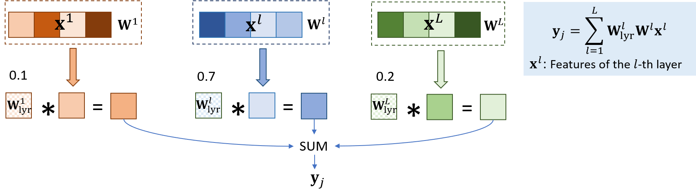

<!--
 * @Author: zhouqy
 * @Date: 2022-06-04 11:40:49
 * @LastEditors: zhouqy
 * @LastEditTime: 2022-07-11 23:43:26
 * @Description:  
-->
# Layer-weighted ROI-wise encoding model

The official implementation of the layer-weighted ROI-wise encoding model described in **Exploring the brain-like properties of deep neural networks: a neural encoding perspective**.



## 1. Installation
Create and activate the environment:
```shell
conda create -n lwnenc python==3.7
conda activate lwnenc
```
Install dependencies:
```shell
pip install -r requirements.txt
```

## 2. Usage
**Step 1: Dataset preparation**

The dataset can be downloaded from [The Algonauts Project 2021](http://algonauts.csail.mit.edu/challenge.html). Save stimuli and neural responses to ```./AlgonautsVideos268_All_30fpsmax``` and ```./participants_data_v2021```, respectively.


**Step 2: Feature extraction** 

Feature extraction by AlexNet is currently supported. The function of extracting features of various DNNs is coming soon.
```python
python ./feature_extraction/generate_features.py -fname='alexnet' -dim_rd='srp' -ad='feature_zoo' -gpu='0' -rp='./'
```
where ```-dim_rd='srp'``` means that the dimension of the features of the convolutional layers will be reduced by the Sparse Random Projection. And the features will be saved to this folder ```./feature_zoo/```.

**Step 3: Model fitting**

Train the layer-weighted ROI-wise encoding model. First, select best hyper-parameters for the ridge regression regularization (```-wc```) and the sparseness regularization on the layer re-weights (```-lay```) on the first subject. 
The following code is an example on V1. You can specify ```-roi``` to fit the voxels of other ROIs. You can also change the scope of the grid search.
```python
cd ./code
for wc in 1e0 1e1 1e2
do
for lay in 1e-1 1e0 1e1
do
python ./perform_encoding.py -gpu='0' -ad='feature_zoo' -rd='results' -rp='../' -dim_rd='srp' -e=500 -roi='V1' -sub=1 -m='hyper_tune' -model='alexnet' -wc=$wc -lay=$lay -fn=2 -pat=30 -delta=1e-3 -mtc='pcc' -cp='summary_pcc_'
done
done
```

Second, train the model using the selected hyper-parameters on all subjects and all ROIs.
```python
python ./perform_encoding.py -gpu='0' -ad='feature_zoo' -rd='results' -rp='../' -dim_rd='srp' -e=500 -roi='V1' -sub=10 -m='train' -model='alexnet' -wc=0 -lay=0 -fn=2 -pat=30 -delta=1e-3 -mtc='pcc' -cp='summary_pcc_'
```
In this stage, if ```-wc=0,-lay=0```, the code will automatically load the best hyper-parameters found in the first stage and use them to train models on all subjects. 

**Step 4: Result summarizing**

Save the average results on all subjects and all ROIs into a ```.csv``` file.
```python
python aver_from_csv.py -cp='summary_pcc_' -model='alexnet' -rp='../' -dim_rd='srp' -rd='results'
```

You can also run step 2-4 by ```bash ./code/run.sh``` directly. The code will fit models on **all ROIs and all subjects**. Finally, the results will be saved to ```./results```.

## 3. Cite
If you find this code helpful for your research, please cite our paper:
```tex
@article{zhou2022exploring,
  title   = {Exploring the brain-like properties of deep neural networks: A neural encoding perspective},
  author  = {Zhou, Qiongyi and Du, Changde and He, Huiguang},
  journal = {Machine Intelligence Research},
  year    = {2022},
  publisher = {Springer}
}
```